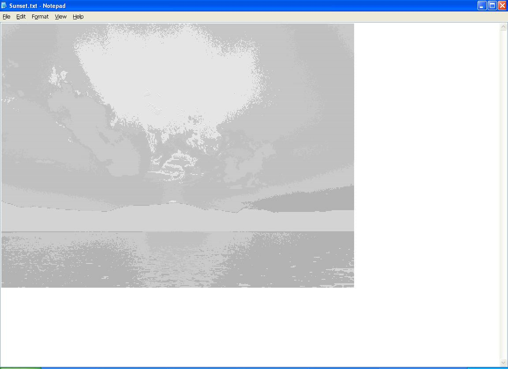



## PURE ASCII Art Generator

### Description

Converts a normal bitmap or other picture file into Ascii art that can be viewed in notepad at a certain font size (such as 1). The sample picture was made with one light-to-dark setting. With a more specific setting, you can make much more detailed pictures.

I got the idea for this program I made (under StarCraftPro username) for creating a similar coloured HTML picture generator. Bryant Zadegan's comment made me take ascii art to another level. Anyway, here it is!
 
### More Info
 

             |
---                |---
**Submitted On**   |2004-08-21 14:17:12
**By**             |[AirHead3\.0](https://github.com/Planet-Source-Code/PSCIndex/blob/master/ByAuthor/airhead3-0.md)
**Level**          |Intermediate
**User Rating**    |5.0 (35 globes from 7 users)
**Compatibility**  |VB 6\.0
**Category**       |[Graphics](https://github.com/Planet-Source-Code/PSCIndex/blob/master/ByCategory/graphics__1-46.md)
**World**          |[Visual Basic](https://github.com/Planet-Source-Code/PSCIndex/blob/master/ByWorld/visual-basic.md)
**Archive File**   |[PURE\_ASCII190893742005\.zip](https://github.com/Planet-Source-Code/airhead3-0-pure-ascii-art-generator__1-61512/archive/master.zip)

